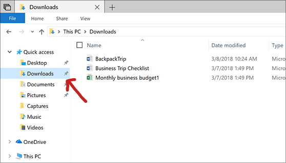

<h1 align="left"> Eaglercraft</h1>

## What is Eaglercraft?
Eaglercraft is a website/file version of minecraft for students and many others to enjoy, Eaglercraft has the following versions consisting of Beta, Alpha, Indev, Infdev, all the way up to version 1.11 javascript runtime. Multiplayer, singleplayer, and LAN worlds available. Customizable profile, skins, capes, and controls. Game modes including creative, survival, peaceful, and more! Villages, mine shafts, dungeons, caves, ravines, many different biomes, and other things can spawn. The Nether and End are also available. Commands are the same as the real Minecraft. Basically what this is, its just all eagler versions known in html file format.
- [Eaglercraft Server List](https://github.com/Dthesle/eagler/blob/main/SERVERS.md)
    - Servers works for 1.5.2 and higher, depending on which servers it is.
- [Changelog](https://github.com/Dthesle/eagler/blob/main/CHANGELOG.md)

> [!NOTE]
> EC stands for Eaglercraft.
> - **Extra Note:** I do not own Eaglercraft, nor did I make Eaglercraft, and I am not associated with it in any way, this is just a way for people to access it fullscreen on browser.
>   - **Another note:** When you create a new world, it will be a black screen, or you may have spawned underground. ALL YOU HAVE TO DO IS WAIT 30 SECONDS TO 5 MINUTES MAX! It will fix on its own. It will also be laggy at first, but it will smooth out after 5–10 minutes. Keep in mind that these are website/file versions of Minecraft and that not everything in the real current Minecraft will be avialable.
>     - **Another Extra Note:** the links may be blocked accorrding to me since my blocker consistently blocks links (Lightspeed Filter Agent)

> [!IMPORTANT]
> if you're on chromebook, when you download the files, they'll always be in your google drive.
>  - if you're on a managed computer (such as windows) it'll always be in your file explorer, like for example:
<h3 align="center">
  
</h3>

> [!WARNING]
> Don't change ANYTHING besides the tab name in the code unless you want the entire file to break.

> [!CAUTION]
> This can be taken down at any moment and I completely understand.
> - everything is broken rn besides 1.8.8 (file) and the links

> [!TIP]
> Download for better usage and portability, blah blah blah

<table>
  <tr>
    <th>Current Versions</th>
  </tr>
  <tr>
    <td>EC - Alpha 1.2.6</td>
  </tr>
  <tr>
    <td>EC - Beta 1.3</td>
  </tr>
  <tr>
    <td>EC - Beta 1.7.3</td>
     </tr>
  <tr>
    <td>EC - Indev</td>
  </tr>
  <tr>
    <td>EC - Infdev</td>
     </tr>
  <tr>
    <td>EC - 1.2.5</td>
  </tr>
  <tr>
    <td>EC - 1.5.2</td>
     </tr>
  <tr>
    <td>EC - 1.8.8</td>
  </tr>
</table>

> There's 1.9 and 1.11 but they're link variants and are more likely to get blocked so..
### Links:
1.8.8 Forge
```ruby
https://webmc.xyz/mc/1.8.8-forge/
```
1.9
```ruby
https://webmc.xyz/mc/1.9/
```
1.11
```ruby
https://webmc.xyz/mc/1.11/
```

> ### pros for eagler:
> - minecraft in school
> - multiplayer
> - offline capability
> - html file download
> ### cons for eagler:
> -  is illegal
> -  i forgor

## To Do: 
- [x] Upload all Eaglercraft Files
- [ ] Fix all Eaglercraft Files
- [ ] Try to host with Github Pages

thanks for being here ig
```ruby
print('you reached the end!');
  if [viewer] = [end] then quit
    then reload [page] after [5] seconds
  wait [5] seconds
  once reload after [5] then star
    if [star] then follow [viewer]
```
